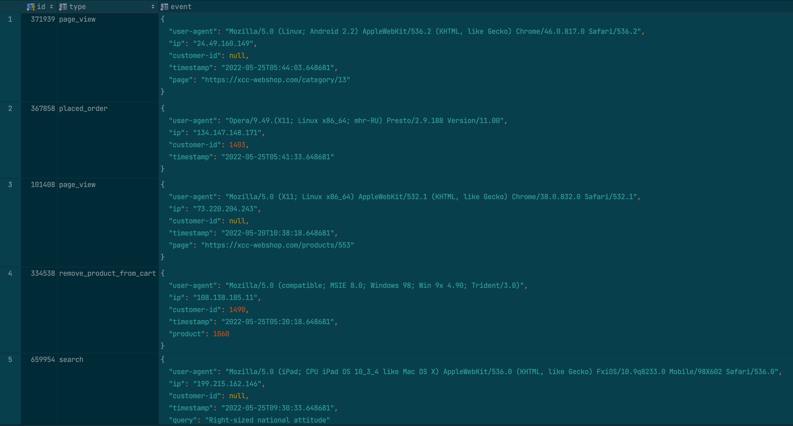

# Analytics Engineer Assessment

This assessment is designed to evaluate your SQL skills, data modelling expertise, and ability to create solutions that empower end users. Using **dbt**, you will work with raw data in a PostgreSQL database to build a structured data warehouse. **Your task is to design, implement, and document a data model that follows analytics engineering best practices.**

Please review each section below to understand what’s expected.

## Context

In addition to running a successful training and consulting business, Xccelerated also operates a **very real** and **totally non-fictitious** webshop selling a variety of **real products**, including:

- Adaptive bi-directional analyzers;
- Yak shaving shears;
- Organic foreground paradigms;
- Intuitive asymmetric cores;
- Multi-lateral 6th-generation service-desk;
- Seamless 4th-generation applications.

Analytics from this webshop support key questions about user behavior, session patterns, and purchasing insights. Many stakeholders depend on the data you organize to guide business decisions.

You’ll work with data from a transactional system. The data includes tables from the operational database of our webshop, such as:

- customer
- product
- event
- _etc._

Every day, an **Extract and Load** job runs that extracts all records that have been modified that day and appends them to the [staging](https://en.wikipedia.org/wiki/Staging_(data))
tables of our data warehouse. You should use these staging tables as the basis for the upcoming tasks.

## Tasks

This assignment consists of several tasks that progressively build a robust data pipeline and data warehouse. Each step should be approached with attention to best practices, documentation, and data quality.

> **Note:** You are required to use dbt for this assignment. If you’re not familiar with dbt, this is a great opportunity to learn. Give the [dbt documentation](https://docs.getdbt.com/docs/introduction) a read.

### 1. Data Ingestion and Initial Setup

0. **Using devcontainers (optional)**

A devcontainer json file has been provided and can be used to get a working environment. 
A [tutorial](https://code.visualstudio.com/docs/devcontainers/tutorial) for using devcontainers can be found here.
If you wan't want to use devcontainers you can also setup a local environment.

1. **Get the credentials**

We have setup an environment for you with the initial raw data. This will be stored in a postgres database and the credentials can be found in the issues tab of the repository with your asssessment.

2. **Connect PostgreSQL to dbt**

Use dbt to connect to the postgres instance. 
For this you can use the previously mentioned credentials and follw [this](https://docs.getdbt.com/docs/core/connect-data-platform/about-core-connections) setup guide.
To make sure it runs you should be able to run ```dbt debug``` without any errors.


### 2. Questions from the business

Now that we have a connection to the raw data we can start answering some questions. The business has three things they want to be able to query, namely:
- The average time between placed and shipped orders for every week
- A list of emails and the cart value of items added in a customers last session if they have placed an order in that last session (more information about sessions can be found in a later section of this document)
- The total amount of discount given in each week

In order to be able to answer these questions in a more robust and reusable way, the team has decided to first build a small warehouse and a mart on top of that to answer these questions.
The team has decided to use the [Kimball Dimensional Modeling](https://docs.getdbt.com/blog/kimball-dimensional-model) way of modeling data.
The team is very busy, however, and decided that the full responsibility lies with you.
In practice this teams the following:
- Design a data warehouse that adheres to Kimball, forming the basis for answering the questions above.
  - Ensure that you are able to explain your decisions and assumptions.
  - You are free to pick the granularity and structure.
  - Make sure to only design the parts that you need for the questions/metrics.
- Make the sources usable by using [dbt sources](https://docs.getdbt.com/docs/build/sources).
- Model the data according to your design.
- Build the marts to answer the questions above.

Keep dbt’s project [structure](https://docs.getdbt.com/best-practices/how-we-structure/1-guide-overview) and [style](https://docs.getdbt.com/best-practices/how-we-style/0-how-we-style-our-dbt-projects) best practices in mind while designing your models.

### 3. Bonus tasks

Additionally, there are some bonus tasks. If you have some time left, you can try to incorporate these but they are not required for a complete solution!

##### Incremental

For the design you have probably used SCD in some way, to deal with the duplicate keys.
To make it more robust and deal with new incoming data you might need to make some changes to the way you deal with SCD.
To achieve this [incremental models](https://docs.getdbt.com/docs/build/incremental-models-overview) from dbt is probably the way to go.
So as a bonus, try to use incremental (or another way) to improve your SCDs.

##### Testing and Quality Assurance

After modeling and answering the questions, it's good to include some extra stuff to make it a bit more robust.
Namely, it would be good to add some tests to ensure data correctness as it comes in and to validate its integrity.
A good source for testing is dbt itself which can be found [here](https://docs.getdbt.com/docs/build/data-tests).

## Evaluation

You will present your solution with the evaluation based on both your presentation and the solution itself. Please provide the working solution in advance (short notice is fine) by pushing it to this GitHub repository.

This assessment is about creating a data-driven solution that benefits end users and meets real-world business needs.

Your solution should work on the PostgreSQL database provided, and your dbt jobs should run with no (or minimal) errors. We’re looking to see that you’re capable of building an end-to-end product.

Your solution must work out-of-the-box for a user with a reasonably technical background. The README should be clear and concise, providing all necessary information to run the project.

## Timeframe

If you can complete the assessment in approximately 10 to 12 hours, that’s a good sign. Needing a little more time is fine too, however, please avoid spending significantly more time. It’s better to deliver a simple, working solution than an incomplete, complex one.

Let us know if you feel that the time estimate is inaccurate, as your feedback is valuable to us.

## Sessions
In order to answer questions around user activity on our webshop, the engineers who built our shop made sure to track user events. These events include:

- PAGE_VIEW
- ADD_PRODUCT_TO_CART
- REMOVE_PRODUCT_FROM_CART
- SIGN_UP_SUCCESS
- VISIT_RELATED_PRODUCT
- VISIT_RECENTLY_VISITED_PRODUCT
- VISIT_PERSONAL_RECOMMENDATION
- SEARCH

all events are stored with a timestamp, an event_type and additional event data in a table in the database. 
This event-data typically includes the users user-agent, ip address and customer-id if they are logged in.
Additionally, page-view events contain the url of the page the customer visited, as well as a referrer if 
they came from an external location.

A small sample of this data can be found below:



If you put all these events on a timeline for each user, you will find short periods of high activity, 
followed by longer periods of inactivity. 


These high activity periods can be considered as a users' session.


For this assessment, we'll only focus on easily identifiable customers that have logged in (e.g. have a not-null customer-id)

## Questions

If you have any questions, please reach out to our CTO Matthijs at mbrouns@xccelerated.io, or one of our DE Leads Rick (rvergunst@xccelerated.io) or Gary (gclark@xccelerated.io).
